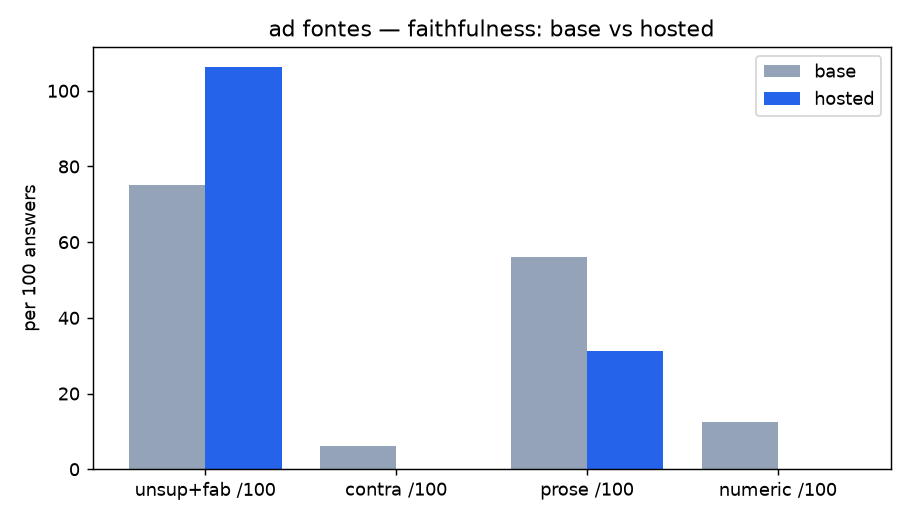

<!-- DRY RUN: base (Qwen2.5-1.5B) vs the hosted 7B as a stand-in for the tuned model,
16 questions. Proves the Phase 5 harness works end-to-end (pipeline force_generator,
paired bootstrap CIs, LLM judge win rate, plot). The real base-vs-tuned run needs the
DPO GGUF and uses the full holdout with >=2 repeats. On 16 questions every CI includes
0 — that is the harness correctly reporting "not enough signal", not a result. -->

# Compare — base vs hosted — 2026-09-05T22:42:56+00:00

- commit `b8188cf` · corpus `2026-09-05` · 16 held-out/adversarial/negative questions · 2000 bootstrap resamples
- generator mix — A: {'local-base': 16} · B: {'hosted-fallback': 16}

## Headline (lower is better; ✓ = 95% CI excludes 0 in the good direction)

| metric | base | hosted | Δ (B−A) [95% CI] |
|--|--|--|--|
| **unsupported + fabricated / 100** | 75.0 | 106.2 | 31.25 [-37.5, 106.25] |
| contradicted / 100 | 6.2 | 0.0 | -6.25 [-18.75, 0.0] |
| unverified prose / 100 | 56.2 | 31.2 | -25.0 [-68.75, 18.75] |
| numeric violations / 100 | 12.5 | 0.0 | -12.5 [-31.25, 0.0] |
| mean prose chars | 395 | 368 | -26.81 [-132.31, 70.81] |

## Behaviour

| metric | base | hosted |
|--|--|--|
| supported rate | 0.35 | 0.43 |
| decline on unanswerable | 0.0 | 0.0 |
| false-decline on answerable | 0.0 | 0.0 |
| latency p50 / p95 ms | 17406 / 31500 | 5734 / 12375 |

## LLM judge win rate (blind A/B, faithful-and-humble)

`hosted` wins **0.625** of decided pairs ({'a_wins': 6, 'b_wins': 10, 'ties': 0, 'b_win_rate_decided': 0.625})

